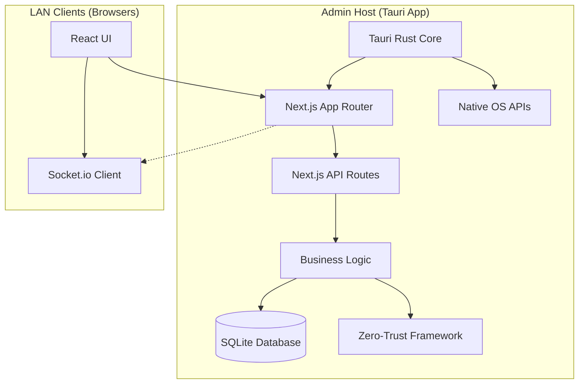

# Architecture

> Auto-generated by /map on 2026-03-01

## Overview

A HIPAA-compliant medical records management system migrated to a **Tauri + Next.js** architecture. It operates as a "Service Server" on the host laptop, providing native admin tools via Tauri and a web-accessible dashboard for LAN clients via Next.js.

## Components

### Electron Core
- **Purpose:** Host the application and manage system-level operations.
- **Location:** `main.js`, `preload.js`
- **Dependencies:** `electron`

### Backend Server
- **Purpose:** Handle data persistence, business logic, and security.
- **Location:** `server/`
- **Dependencies:** `express`, `sqlite3`, `socket.io`, `crypto-js`

### Frontend UI
- **Purpose:** Provide a responsive interface for various medical roles.
- **Location:** `client/`
- **Dependencies:** `Vanilla JS`, `CSS`, `@faker-js/faker` (for dev)

## Data Flow

1. **User Action:** User interacts with the dashboard (e.g., search patient).
2. **API Call:** Frontend sends a request via Socket.io or Fetch to the local Express server.
3. **Security Check:** Zero-Trust middleware validates the request and session.
4. **Data Access:** Server queries the SQLite database.
5. **Encryption:** Sensitive fields are decrypted on-the-fly for the authorized user.
6. **Response:** Data is sent back to the UI for rendering.

## Integration Points

| Service | Type | Purpose |
|---------|------|---------|
| Local SQLite | Database | Primary patient data storage |
| Socket.io | WebSocket | Real-time messaging and notifications |
| Nodemailer | SMTP | Potential email integration for notifications |

## Technical Debt

- [ ] Transition remaining Socket.io emitters to REST API where appropriate for consistency.
- [ ] Implement robust error boundaries in the renderer process.
- [ ] Add unit tests for the Zero-Trust encryption utilities.

## Conventions

**Naming:** camelCase for variables/functions, PascalCase for classes, UPPER_SNAKE_CASE for constants.
**Structure:** Separate routes, utilities, and database logic in the `server/` directory.
**Testing:** Currently minimal automated tests; prioritize critical security paths.
